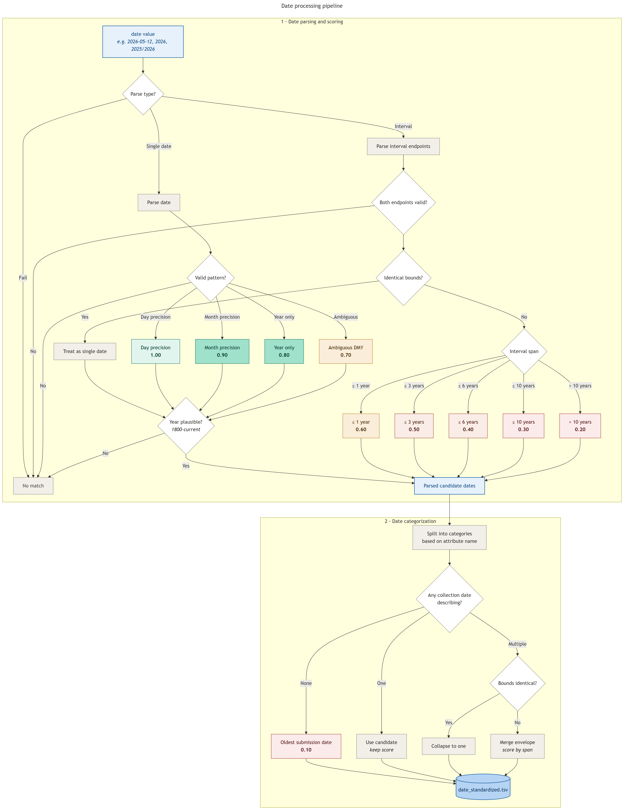

# Collection date standardization

Map sample collection date annotations from sample metadata to ISO-formatted `[start, end]` date
bounds.

[Source](https://github.com/kadan02/BacCurate/blob/main/src/baccurate/standardizers/date.py)

## Contents

- [Usage](#usage)
- [Configuration](#configuration)
- [Inputs](#inputs)
- [Outputs](#outputs)
- [Data usage recommendations](#data-usage-recommendations)
- [Methods](#methods)
  - [Workflow](#workflow)
  - [Date formats](#date-formats)
  - [Parsing into bounds](#parsing-into-bounds)
  - [Reliability score](#reliability-score)
  - [Multiple different sampling dates](#multiple-different-sampling-dates)
  - [Worked example](#worked-example)

## Usage

Run the collection-date pipeline for one or more pathogens with the `date` attribute:

```bash
uv run baccurate <pathogen> --attribute date
```

See the [main README](../README.md#usage) for installation and the full set of options.

## Inputs

| Column           | Description                                                                       |
| ---------------- | --------------------------------------------------------------------------------- |
| `accession`      | Record ID                                                                         |
| `date_attr_orig` | `\|\|`-separated attribute names                                                  |
| `date_val_orig`  | `\|\|`-separated values, paired by position with `date_attr_orig`                 |
| `date_category`  | `\|\|`-separated single-letter categories. `s` for sampling, `o` for non-sampling |

## Outputs

| Column           | Description                                  |
| ---------------- | -------------------------------------------- |
| `accession`      | Record ID                                    |
| `date_start`     | ISO-format earliest possible collection date |
| `date_end`       | ISO-format latest possible collection date   |
| `date_score`     | See [below](#reliability-score)              |
| `date_attr_orig` | Unstandardized input attribute(s)            |
| `date_val_orig`  | Unstandardized input value(s)                |

## Data usage recommendations

For most analyses, filtering on `date_score >= 0.8` retains day-, month-, and year-precision matches
in unambiguous formats, with no interval merging or fallback to non-sampling dates.

The 0.1 fallback score indicates no sampling date was available and the returned date refers to a
different event (usually submission date). These should usually be excluded unless the surrogate
date is acceptable for the analysis.

## Methods

### Workflow



Each input value is tried as an interval first (`A/B`, `A to B`, `A - B`), then as a single date.
Within each branch, regex patterns are tested in priority order and the first match wins.

### Date formats

A list of named regex patterns are loaded from `config/date.yaml`. Each is tied to a precision
score. Inputs that do not match any known pattern are rejected.

Time components (`HH:MM:SS`, timezone offsets) are stripped before pattern matching. Any year
outside `[1800, current_year]` is rejected.

### Parsing into bounds

A parsed date is widened into `[start, end]` bounds at its parse precision:

| Precision | Example input | Bounds                     |
| --------- | ------------- | -------------------------- |
| Day       | `2026-05-12`  | `[2026-05-12, 2026-05-12]` |
| Month     | `2026-05`     | `[2026-05-01, 2026-05-30]` |
| Year      | `2026`        | `[2026-01-01, 2026-12-31]` |

Output bounds span the full uncertainty of the input. Intervals (`2025/2026`,
`May 2026 to July 2026`) parse both endpoints and return the union of their bounds. Reversed
intervals (end before start) are normalized to `[min(start), max(end)]`.

### Reliability score

The score reflects the parse confidence and ambiguity.

| Score | Description                                                                  |
| ----: | ---------------------------------------------------------------------------- |
|   1.0 | Day-precision match in unambiguous format (`yyyy-mm-dd`, `May 12 2026`, ...) |
|   0.9 | Month-precision match (`2026-05`, `May 2026`, ...)                           |
|   0.8 | Year-only match (`2026`)                                                     |
|   0.7 | Day-precision in ambiguous ordering (`12/05/2026`), interpreted as day-first |
|   0.6 | Interval spanning ≤ 1 year                                                   |
|   0.5 | Interval spanning ≤ 3 years                                                  |
|   0.4 | Interval spanning ≤ 6 years                                                  |
|   0.3 | Interval spanning ≤ 10 years                                                 |
|   0.2 | Interval spanning > 10 years                                                 |
|   0.1 | No sampling date available                                                   |

When two endpoints of an interval expand to identical bounds (e.g. `2026/2026` after both endpoints
expand to year-bounds), the entry is treated as a single year-precision match and scored
accordingly.

### Multiple different sampling dates

When a record has more than one sampling date with divergent bounds, they are merged into an
envelope spanning all values, with the score derived from the envelope's span using the interval
scoring table above. The output row's `date_attr_orig` and `date_val_orig` columns are filled with
`||`-joined lists.
