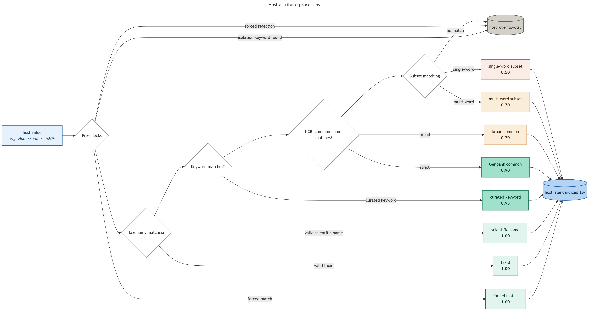

# Host standardization

Map host annotations from sample metadata to NCBI Taxonomy ID and scientific names (binomial nomenclature).

[Source](https://github.com/kadan02/BacCurate/blob/main/src/baccurate/standardizers/host.py)

## Contents

- [Usage](#usage)
- [Configuration](#configuration)
- [Inputs](#inputs)
- [Outputs](#outputs)
- [Data usage recommendations](#data-usage-recommendations)
- [Methods](#methods)
  - [Workflow](#workflow)
  - [Taxonomy reference](#taxonomy-reference)
  - [Matching cascade](#matching-cascade)
  - [Reliability score](#reliability-score)
  - [Isolation-source preemption](#isolation-source-preemption)
  - [Curated taxa and value rejections](#curated-taxa-and-value-rejections)

## Usage

Run the host pipeline for one or more pathogens with the `host` attribute:

```bash
uv run baccurate <pathogen> --attribute host
```
See the [main README](../README.md#usage) for installation and the full set of options.

## Configuration


[`config/host.yaml`](../config/host.yaml) contains:

```yaml
schema_version: 2
normalization:
  ignored_substrings:  # stripped before matching
    - healthy
    - ", juvenile"

routing:
  isolation_source_keywords:  # whole-word matches are passed to iso-source
    - food
    - soil

curated_taxa:
  "9520":
    scientific_name: Saimiri
    match_terms:
      force:
        - Squirrel monkey

value_rejections:      # rejected as hosts and preserved as host overflow
  exact:
    - cancer
```

## Inputs

A TSV file with one row per record:

| Column           | Description                                                       |
|------------------|-------------------------------------------------------------------|
| `accession`      | Record ID                                                         |
| `host_attr_orig` | `\|\|`-separated attribute names                                  |
| `host_val_orig`  | `\|\|`-separated values, paired by position with `host_attr_orig` |

## Outputs

| Column                | Description                                                                       |
|-----------------------|-----------------------------------------------------------------------------------|
| `accession`           | Record ID                                                                         |
| `host_taxid`          | NCBI taxonomy ID                                                                  |
| `host_sci_name`       | Linnaean/Binomial name                                                            |
| `host_score`          | See [below](#reliability-score)                                                   |
| `host_low_conf`       | Boolean review flag                                                               |
| `host_common_names`   | Comma-separated NCBI common names for the host taxid                              |
| `host_lineage_names`  | Comma-separated ancestor scientific names, root-to-tip, limited to standard ranks |
| `host_lineage_taxids` | Comma-separated NCBI taxids, paired by position with `host_lineage_names`         |
| `host_attr_orig`      | Unstandardized input attribute(s)                                                 |
| `host_val_orig`       | Unstandardized input value(s)                                                     |

`host_overflow.tsv` lists records forwarded to the
isolation-source pipeline. A record may appear in both files when it has multiple input rows
and at least one row hit an iso-source keyword while another produced a host match.

## Data usage recommendations

Filtering on `reliability_score >= 0.9 AND
low_confidence == False` retains matches that came from a taxid,
scientific name, NCBI synonym, locally curated term, or NCBI
`genbank_common_name`, with no subset-match or cross-attribute
ambiguity.

Scores 0.70 (NCBI broad `common_name` or multi-word subset) and 0.50
(single-word subset) should be reviewed before being trusted in downstream analysis.

The `low_confidence` flag is orthogonal to the score: a 1.00 match
can be flagged when two input attributes for the same accession
resolved to different taxa (the highest-scoring one is kept and the
disagreement is flagged), and this is worth filtering on when
attribute consistency matters.

The `attribute` and `value` columns record which input field and
which raw string produced the match, so any output row can be traced
back to its source annotation.

## Methods

### Workflow



The first two checks (isolation-source keywords and preemptive decisions) are
preemptive. The remaining tiers are tried in descending score order.

### Taxonomy reference

`taxids_ncbi.tsv` is the taxonomy reference and carries scientific names,
synonyms, `genbank_common_name`, and `common_name`. Manually curated host
matching policy lives in `config/host.yaml`, where terms are grouped under
their intended taxid. The configured `scientific_name` is checked against the
NCBI reference at startup so it acts as a readable assertion rather than a
second source of taxonomy truth.

### Value mapping

Each `||`-separated value is normalized (lowercased, punctuation
stripped, whitespace collapsed) and mapped to the reference. 
Within a record, all candidates are collected and ranked by
`(score, taxonomic specificity, attribute priority, source position)`,
where `host_taxid` outranks `host`, which outranks other attributes.
Taxonomic specificity is taken from the row order of the taxonomy reference, 
which is sorted from most-specific (subspecies, species)
to least-specific (genus and above), so when two candidates are tied on
score the more specific taxon wins. Subspecies are indexed for exact
matching only, not for subset matching, to avoid trinomial false
positives (e.g. *Gallus gallus gallus* matching `Gallus gallus`).

The two lowest tiers are *subset* matches, not fuzzy matches in the
edit-distance sense: matching is on whole words after normalization.

### Reliability score

| Score | Tier                                                            |
|------:|-----------------------------------------------------------------|
|  1.00 | Direct taxid, exact scientific name, exact synonym, forced term |
|  0.95 | Exact manually curated term                                     |
|  0.90 | NCBI `genbank_common_name`                                      |
|  0.70 | NCBI `common_name`, or multi-word subset match                  |
|  0.50 | Single-word subset match                                        |

Score reflects how the match was made, not how taxonomically specific the
result is.

A `low_confidence` flag is set independently of score on any subset
match, on subset matches that resolved across multiple distinct taxa,
or when multiple input attributes resolved to different taxa.


### Isolation-source preemption

Host and isolation-source annotations are frequently conflated in
the metadata. Values matching any configured isolation-source indicating
keyword (e.g. `food`, `soil`, `meat`) are forwarded to
`host_overflow.tsv` and skip host matching entirely.
Matching is whole-word on the normalized value, so `food` matches
`duck food` but not `seafood`. A multi-word keyword matches when all
of its words are present (order-independent).

### Curated taxa and value rejections

Each `curated_taxa` entry is keyed by a quoted taxid and declares the matching
terms for that taxon:

- `exact` matches only the complete normalized value at score 0.95.
- `subset` also matches the complete value at score 0.95, and may match within
  longer text at the normal 0.70 or 0.50 subset score.
- `force` is an exact, preemptive score-1.0 decision for cases where the NCBI
  vocabulary or ordinary matching cascade would otherwise select the wrong taxon.

`value_rejections.exact` contains values that are rejected as hosts but retained
as host overflow for isolation-source interpretation. Forced terms and value
rejections are evaluated after isolation-source keyword routing and before the
normal matching cascade.

The configuration fails at startup when:
- a taxid is absent
- its declared scientific name disagrees with NCBI
- normalized terms map to multiple taxa
- a term is both a match and rejection
- an unforced term conflicts with an NCBI scientific name or synonym.
