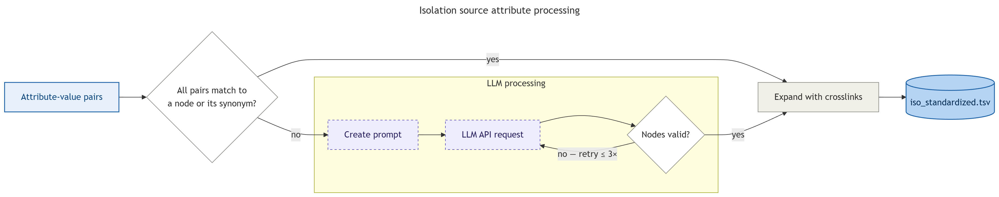

# Isolation source standardization

Map isolation source annotations from sample metadata to curated ontology terms with Large Language
Models.

[Source](https://github.com/kadan02/BacCurate/blob/main/src/baccurate/standardizers/isolation.py)

## Contents

- [Usage](#usage)
- [Configuration](#configuration)
- [Inputs](#inputs)
- [Outputs](#outputs)
- [Data usage recommendations](#data-usage-recommendations)
- [Methods](#methods)
  - [Workflow](#workflow)
  - [Ontology reference](#ontology-reference)
  - [Prompting](#prompting)
  - [Cache and masking](#cache-and-masking)
  - [Direct matching](#direct-matching)
  - [LLM classification](#llm-classification)
- [Benchmarking](#benchmarking)

## Usage

Run the isolation-source pipeline for one or more pathogens with the `iso` attribute:

```bash
uv run baccurate <pathogen> --attribute iso
```

See the [main README](../README.md#usage) for installation and the full set of options.

## Configuration

[`config/isolation_source.yaml`](../config/isolation_source.yaml) contains the `system_prompt` and
`user_prompt` templates for the LLM.

LLM connection details are read from environment variables (`.env` at the root):

| Variable    | Purpose                     |
| ----------- | --------------------------- |
| `API_KEY`   | API key for the LLM service |
| `SERVER`    | OpenAI-compatible base URL  |
| `LLM_MODEL` | Model identifier            |

## Inputs

| Column          | Description                                                      |
| --------------- | ---------------------------------------------------------------- |
| `accession`     | Record ID                                                        |
| `iso_attr_orig` | `\|\|`-separated attribute names                                 |
| `iso_val_orig`  | `\|\|`-separated values, paired by position with `iso_attr_orig` |
| `host_val_orig` | Standardized host (used as additional context for the LLM)       |
| `package`       | NCBI BioSample package name                                      |

## Outputs

| Column             | Description                                                       |
| ------------------ | ----------------------------------------------------------------- |
| `accession`        | Record ID                                                         |
| `iso_attr_orig`    | Unstandardized input attribute(s)                                 |
| `iso_val_orig`     | Unstandardized input value(s)                                     |
| `iso_terms`        | `\|\|`-joined, `:`-separated ontology paths of all selected nodes |
| `iso_display_term` | `\|\|`-joined human readable terms of all selected nodes          |
| `iso_ontology_id`  | `\|\|`-joined ontology IDs, `NA` for nodes without one            |

`isolation_reasoning.jsonl` stores one JSON record per accession with the host context used for
classification and the classifier's reasoning trace: which node-resolution stages fired
(`direct_match`, `classifier`, `crosslink`) and what selections were made at each.

Host values forwarded by the host pass (`host_overflow.tsv`, see [host.md](host.md)) are also
classified here.

## Data usage recommendations

TODO

## Methods

### Workflow



The LLM is called only when deterministic matching fails. The entire ontology is rendered into the
system prompt so the model can pick any node in a single call.

### Ontology reference

The controlled vocabulary is in `data/reference/ontology_terms.tsv` and is parsed as a directed
graph. Each row is one node:

| Column           | Description                                                                           |
| ---------------- | ------------------------------------------------------------------------------------- |
| `term`           | Colon-separated path from root, e.g. `host-associated:animal host:respiratory system` |
| `display_term`   | Unique, human-readable label. The LLM returns these strings                           |
| `ontology_link`  | One or more `;`-separated external IDs (ENVO, UBERON, ...)                            |
| `crosslink_term` | `;`-separated terms with semantic equivalences (e.g. `wound` -> `skin`                |
| `synonyms`       | `;`-separated alternate names. Used only by direct-matching                           |
| `comment`        | Optional disambiguation note, shown to the LLM.                                       |

Tree edges are derived from the `:` structure of `term`. Any prefix of a path is treated as the
parent.

### Prompting

The LLM is shown a Markdown indented list with the `display_term` values visible:

```
# Tree
- host-associated
  - plant host
    ...
  - animal host
    - respiratory system
      ...
    - digestive tract
      - intestine
        - caecum
        - rectum
      ...
    ...
...
```

### Cache and masking

Resolved values are cached in SQLite, keyed by SHA-256 of
`(normalized_attribute | masked_value | normalized_host | model)`. The masking step replaces highly
variable substrings with placeholders before hashing, including dates, coordinates, units,
percentages, identifiers (e.g. `Strain-123`), and bare numbers. Two records with values
`stool sample patient 1` and `stool sample patient 2` produce the same hash because both mask to
`stool sample patient <NUM>`.

`model` means the name of the LLM used.

The cache stores the full standardization result including reasoning. To force reprocessing, delete
`data/cache/llm_iso_cache.db`.

### Direct matching

Each `||`-separated value is matched against two deterministic indexes before any LLM call:

1. The value is scanned for tokens of the form `[A-Z]+:\d+` (e.g. `ENVO:01001004`); if any matches a
   known external ID in the ontology, the corresponding node is selected directly.
2. The value is normalized and looked up against the display-term index (which also indexes the
   `synonyms` column). Substrings do not result in a match.

### LLM classification

When direct match doesn't resolve the input, one API call is made:

1. The cached system prompt and a short user message containing the metadata is sent through the
   API.
2. A `reasoning` string and a list of display terms is returned.
3. Output is validated by a Pydantic `field_validator` built from the set of valid display terms. On
   validation failure the call is retried maximum 3 times.
4. Display terms are mapped back to canonical term paths.
