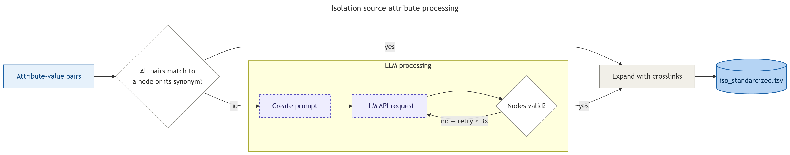

# Isolation source standardization

Isolation source standardization maps isolation source annotations from BioSample metadata to
curated ontology terms, with a large language model (LLM) as a fallback.

[Implementation](../src/baccurate/standardization/isolation_source.py)

## Contents

- [Usage](#usage)
- [Configuration](#configuration)
- [Inputs](#inputs)
- [Outputs](#outputs)
- [Data usage recommendations](#data-usage-recommendations)
- [Methods](#methods)
  - [Workflow](#workflow)
  - [Ontology reference](#ontology-reference)
  - [Prompting](#prompting)
  - [Cache and masking](#cache-and-masking)
  - [Direct matching](#direct-matching)
  - [LLM classification](#llm-classification)
- [Benchmarking](#benchmarking)

## Usage

Select isolation-source standardization for one or more pathogens with the `iso` value:

```bash
uv run baccurate <pathogen> --standardize iso
```

See the [main README](../README.md#usage) for installation and the full set of options.

## Configuration

[`config/isolation_source.yaml`](../config/isolation_source.yaml) contains the `system_prompt` and
`user_prompt` templates for the LLM.

LLM connection details are read from environment variables (`.env` at the root):

| Variable    | Purpose                     |
| ----------- | --------------------------- |
| `API_KEY`   | API key for the LLM service |
| `SERVER`    | OpenAI-compatible base URL  |
| `LLM_MODEL` | Model identifier            |

## Inputs

| Column                 | Description                                                      |
| ---------------------- | ---------------------------------------------------------------- |
| `accession`            | BioSample accession                                              |
| `iso_attr_orig`        | `\|\|`-separated attribute names                                 |
| `iso_val_orig`         | `\|\|`-separated values, paired by position with `iso_attr_orig` |
| `bioproject_id`        | `\|\|`-separated linked BioProject IDs                           |
| `bioproject_accession` | `\|\|`-separated resolved BioProject accessions                  |

The coordinated host/isolation-source standardizer also supplies host context, host overflow, and
resolved BioProject context. BioProject context is provided as secondary evidence for isolation
source.

## Outputs

When isolation source standardization is requested but produces a rejection, all five
isolation-source columns below are empty. An explicit unspecified isolation source is an outcome,
not a rejection: both `iso_term_paths` and `iso_display_terms` contain `unspecified`, while
`iso_external_ontology_identifiers` contains `NA`. When the target is not requested, its columns are
omitted from the standardized dataset.

| Column                              | Description                                                       | Absence form                                                          |
| ----------------------------------- | ----------------------------------------------------------------- | --------------------------------------------------------------------- |
| `accession`                         | BioSample accession                                               | Never absent from a written record                                    |
| `pathogen_scientific_name`          | Target pathogen's registry scientific name                        | Never absent from a written record                                    |
| `iso_attr_orig`                     | Unstandardized input attribute(s)                                 | Empty when no supporting sample attribute is available                |
| `iso_val_orig`                      | Unstandardized input value(s)                                     | Empty when no supporting sample value is available                    |
| `iso_term_paths`                    | `\|\|`-joined, `:`-separated ontology paths of all selected nodes | Empty on rejection; `unspecified` for the explicit unspecified node   |
| `iso_display_terms`                 | `\|\|`-joined human readable terms of all selected nodes          | Empty on rejection; `unspecified` for the explicit unspecified node   |
| `iso_external_ontology_identifiers` | `\|\|`-joined external ontology identifiers                       | Empty on rejection; `NA` for each selected node without an identifier |

`isolation_source_reasoning.jsonl` stores one JSON object per BioSample accession with the host
context used for classification and the classifier's reasoning trace: which node-resolution stages
fired (`direct_match`, `classifier`, `crosslink`) and what selections were made at each.

Host overflow from the initial host pass is also classified here. When the resulting ontology term
indicates a host organism, the selected isolation-source values can support a host recovery pass.

## Data usage recommendations

TODO

## Methods

### Workflow



The LLM is called only when deterministic matching fails. The entire ontology is rendered into the
system prompt so the model can pick any node in a single call.

### Ontology reference

The controlled vocabulary is in `data/reference/ontology_terms.tsv` and is parsed as a directed
graph. Each row is one node:

| Column           | Description                                                                           |
| ---------------- | ------------------------------------------------------------------------------------- |
| `term`           | Colon-separated path from root, e.g. `host-associated:animal host:respiratory system` |
| `display_term`   | Unique, human-readable label. The LLM returns these strings                           |
| `ontology_link`  | One or more `;`-separated external IDs (ENVO, UBERON, ...)                            |
| `crosslink_term` | `;`-separated terms with semantic equivalences (e.g. `wound` -> `skin`                |
| `synonyms`       | `;`-separated alternate names. Used only by direct-matching                           |
| `comment`        | Optional disambiguation note, shown to the LLM.                                       |

Tree edges are derived from the `:` structure of `term`. Any prefix of a path is treated as the
parent.

### Prompting

The LLM is shown a Markdown indented list with the `display_term` values visible:

```
# Tree
- host-associated
  - plant host
    ...
  - animal host
    - respiratory system
      ...
    - digestive tract
      - intestine
        - caecum
        - rectum
      ...
    ...
...
```

### Cache and masking

Resolved values are cached in SQLite, keyed by SHA-256 of
`(normalized_attribute | masked_value | normalized_host | model)`. The masking step replaces highly
variable substrings with placeholders before hashing, including dates, coordinates, units,
percentages, identifiers (e.g. `Strain-123`), and bare numbers. Two records with values
`stool sample patient 1` and `stool sample patient 2` produce the same hash because both mask to
`stool sample patient <NUM>`.

`model` means the name of the LLM used.

The cache stores the full standardization result including reasoning. To force reprocessing, delete
`data/cache/llm_iso_cache.db`.

### Direct matching

Each `||`-separated value is matched against two deterministic indexes before any LLM call:

1. The value is scanned for tokens of the form `[A-Z]+:\d+` (e.g. `ENVO:01001004`); if any matches a
   known external ID in the ontology, the corresponding node is selected directly.
2. The value is normalized and looked up against the display-term index (which also indexes the
   `synonyms` column). Substrings do not result in a match.

### LLM classification

When direct matching does not resolve the input, BacCurate makes one API call:

1. BacCurate sends the cached system prompt and a short user message containing the metadata.
2. The model returns a `reasoning` string and a list of display terms.
3. A Pydantic `field_validator`, built from the valid display terms, validates the output. BacCurate
   retries the call up to three times after validation failures.
4. BacCurate maps the display terms back to canonical term paths.
